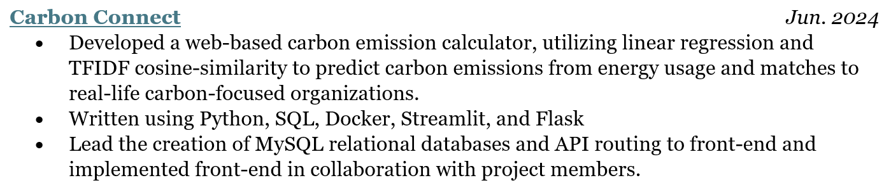

What a grind!

## Final Project Contributions

Overall, I'm proud of how we finished up Carbon Connect. I leaded the first user persona, which means that I wrote up the initial persona and leaded most of the SQL changes, endpoints, and most of the front-end Streamlit. Of course, we all worked with each other, so there was a fair bit of touching up done on other pages (such as fixing up the landing pages) and pair-programming with all of the members (such as when Michael needed some routes to be made, or we were squashing some bugs). Actually, a fair bit of Phase IV was squashing bugs, as some features started working and others broke here and there.

Regardless, we got most of the bugs fixed. There was one slight nice-to-have that we found at the end, which was a stored user-history for their total carbon emission footprint, but as Justin and I dedicated numerous hours on Monday morning, it would have caused an entire restructuring of the entire User backend, which was a major risk for the time frame. That feature is, however, implemented for Enterprises.

## Joys & Challenges

The most challenging part was probably the end of Phase III, because of how all of our data was structured around the results of the linear regression that had to be done. This meant that all of our SQL was simply a template, and had to be restructured on a whim. The part that I found surprisingly enjoyable was the discussion I had with Luc Alaerts of Leuven 2030/KU Leuven, in which he discussed the circular economy and a similar project that had taken place on a more macro-level. While the conversation pointed out a few lacking aspects that was present at the time, it allowed me to be more reflective on the goal of the app. Additionally, I enjoyed the little joys that came along the way, such as when an icon was finally centered, or we saw that sweet green "Submitted" popup for the database.

Below, see a quick resume draft for Carbon Connect.

