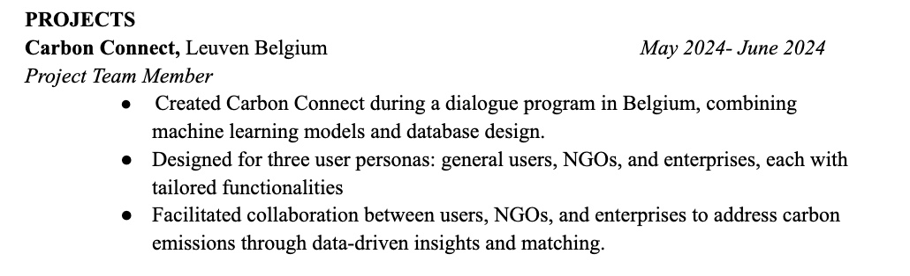

# Phase 4 Dialogue Reflection
During the final page of this project, I mainly worked on the NGO entity, which included implementing a better UI for better user experience for deleting and adding tags by implementing the Streamlit pills format. I also created a way for enterprises to view survey emission history and implemented a new route in order to retrieve this information. Additionally, I successfully implemented our final logo within our website, fixed the navigation to reduce the number of pages, and created more of a vertical website instead of having numerous pages.

I did struggle a little bit when it came to the UI design of the page, since design is subjective to each person who views it, and it took patience to understand others' feedback and make sure that my design was user-friendly. I also had to learn to import and use different Streamlit tools that I was not familiar with before, and since pills were not the most customizable, it took me a little bit to find out what I could and could not do with this new implementation. Additionally, finding ways to access data within dictionaries was something that I needed to research and find hurdles around since I initially wasn’t familiar with Python dictionary data types. In conclusion, throughout this phase of the project, I learned a lot more about what I liked and didn’t find interesting as a developer and also found areas that I want to learn more about in the future.

As a whole, in the project, the most difficult parts were getting used to creating routes and retrieving data, while the most enjoyable part was adding design aspects, for example, the logo and also the overall look and feel of the page. Since I find myself enjoying art and design, I think that front-end development is definitely something that I want to expand into in the future.

As this dialogue comes to an end, I am quite sad but happy for what is to come. This dialogue was an amazing experience in that I expanded my software knowledge immensely and was also able to meet lifelong friends and immerse myself in a culture that I was not familiar with. I truly want to sincerely thank Dr. Fontenot and Dr. Gerber for all that they have done. Before this experience, I was so nervous to work on professional projects since I felt like I was not capable enough. Through their kindness and patience, I was able to learn so much more than I thought I could and learned that I can and will become a capable software engineer. I also just want to thank them for taking the time to get to know each and every one of us, and I appreciate the relationships that I have built with them. They are truly amazing people that I hope I will continue to see in the future. I will never forget this experience, and I am excited to see where this experience will take me as I develop within my professional journey.

## Resume Template
