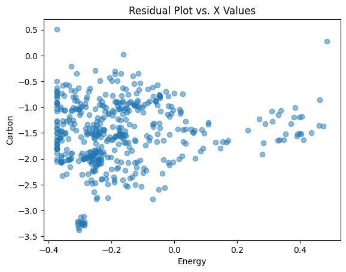
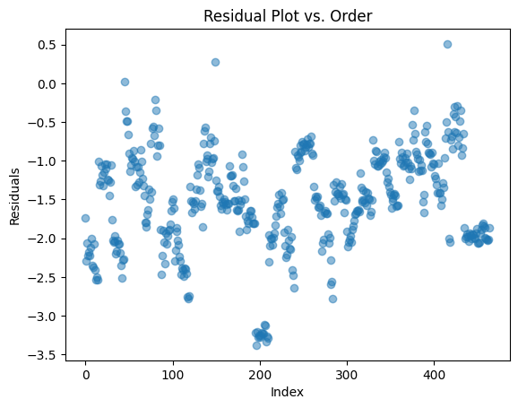
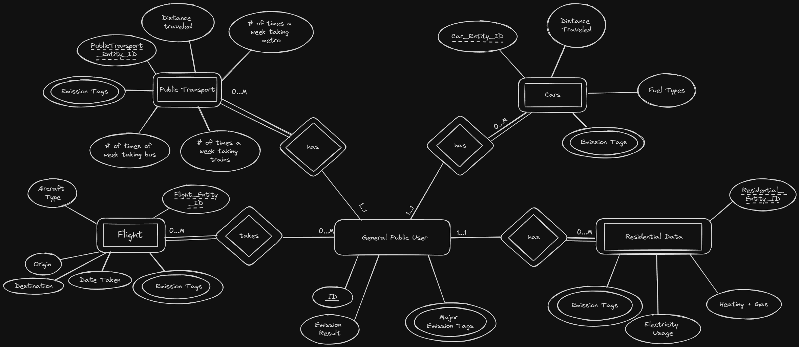
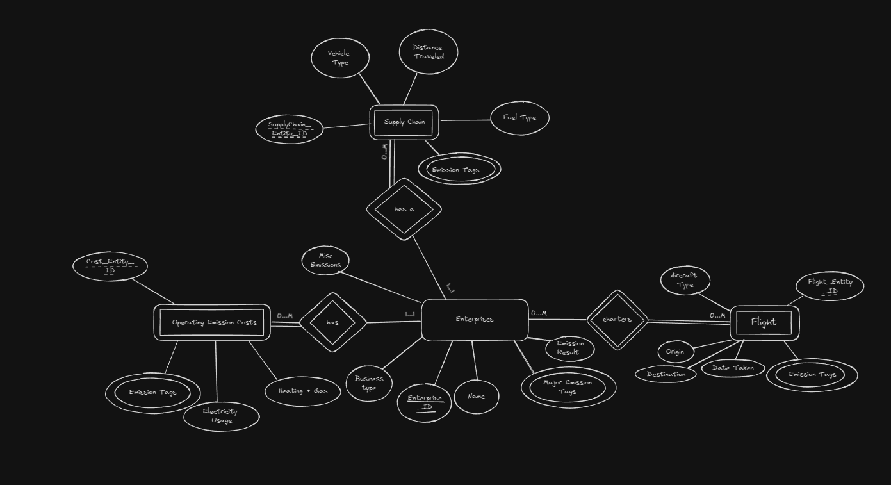
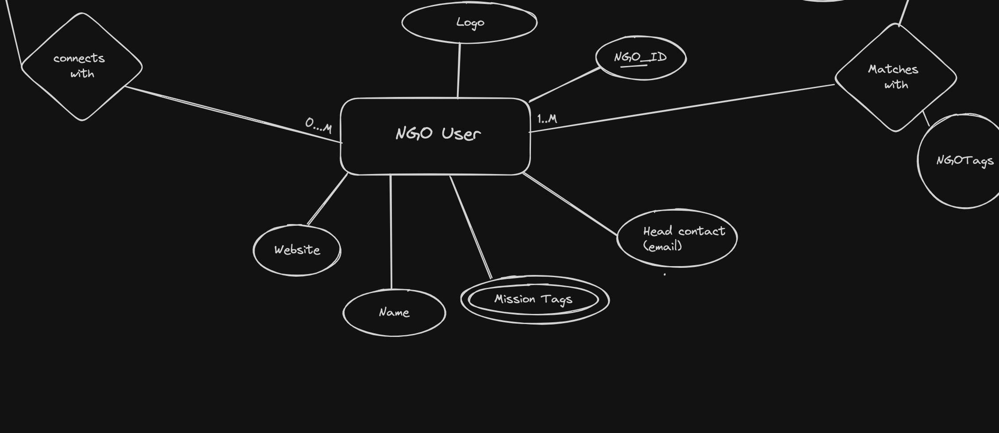
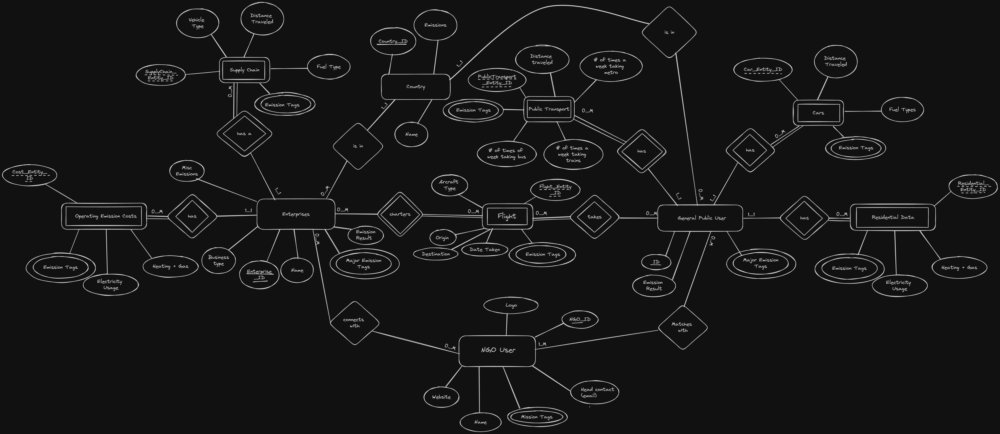

## Changes to Phase I

### Updates to Project Description

Enterprises, ranging from local businesses to large corporations are major contributors to global carbon emissions. To provide perspective on the carbon footprints of these entities, this app would provide a feature for corporations to collect information on their own contributions to their country’s footprint. This would allow enterprises to gain insight into their company-wide impact, as well as receive information on the changes needed to be made and the corresponding implementations. To do this, enterprises can additionally gain knowledge from organizations that have dedicated time to researching and combating these issues.

### Updates to User Persona

#### New Persona #3: EcoForward Enterprises

Description: EcoForward Enterprises is an enterprise that sells energy-efficient lighting. Their mission is aligned with trying to become a greener company, but they feel as if there is an improvement that they can invest in to better match that mission. They are interested in trying to reduce their carbon footprint to gain more of their target consumers.

User Story #1: As an enterprise, I want to be able to see the analytics of our carbon emissions so that I can be able to closely estimate our emissions based on transportation, operating emission costs, and more. This would provide an opportunity to reduce costs and invest in more eco-friendly sources within our supply chain.

User Story #2: As an enterprise, I want to be matched with NGOs based on my emission problem areas so that I can gain insight into how to improve. It would be useful to have those problem areas highlighted to me and for the app to generate easy-to-read tags so I know what emission areas I am lacking in.

User Story #3: As an enterprise, I want to understand my contribution to my country’s emissions in comparison to the average company so that I can compete with other companies within the market and obtain an optimal position as a cleaner company to attract more of my target market.

### New Additional Questions:

- What is the contribution of a business to a macro-level impact of CO2 emissions?

  - This question depends on the scale of the involved business—the scope could be on a local or national level and will measure the impact that business practices have on the emissions of a nation and the European Union as a whole. Furthermore, the internal breakdown of emissions will provide a clearer picture of the measures that need to be taken to reduce this impact.

- How can organizations that combat climate change be matched with interested parties?

  - This question combines user/enterprise data with a repository of organizations that combat different sources of climate change, such as an organization combating electric inefficiencies being matched with a person that has a high electricity usage. This question could also encourage partnerships between such organizations and companies currently afflicted with carbon emission-related issues.

## Data Analysis & Machine Learning

In Phase II a prototype Machine Learning model for the carbon survey was created. This model would be quite similar for both businesses and individual users, differing in training data (businesses would have more industry-focused data rather than the residential data used for individuals).

### New Datasets

While searching for data, the datasources have not changed (all the data is still provided from Eurostat accessed through their API) but the datasets have changed. For the preliminary model, only [Final Energy Consumed](https://ec.europa.eu/eurostat/databrowser/view/nrg_cb_e__custom_11585674/default/table?lang=en) vs [Carbon](https://ec.europa.eu/eurostat/databrowser/view/env_ac_ainah_r2__custom_11584723/default/table?lang=en) were used. In the future, more datasets from Eurostat will be used in both the residential and industrial spaces in order to provide more features for the Linear Regression Model.

### Exploratory Data Analysis

Most of the exploratory work was performed with the Carbon Emissions being predicted through Energy Usage. Over the next Phase, the goal is to integrate additional sources in order to more accurately predict carbon emissions.

This massive pairplot (zooming required) on just the Airborn Carbon Emissions for 32 countries (the core 27 EU members as well as some others) shows that some countries strongly cooralate with each other, which could cause problems when performing regression. One solution for this would be to create an independent model for each country instead of 1-hot encoding the countries as is currently done.

The scatterplots of the data are below.

Carbon (Tonnes):

                    

Energy (Giga-watt Hours):

                            

                    

The following graph shows a scatter plot of the aftermentioned Carbon (Y-axis) and Energy(X-axis). It can be observed that some relationship exists, with most of the points being on the left side of the graph, tending downwards and to the right. Some points can be seen on the bottom left edge and side in perfectly vertical/horizontal patches. These points are countries that had some degree of missing data and were filled in at the mean, resulting in them becoming fixed on a certain line. Better data cleaning techniques such as applying regression on the points would have helped make the points more realistic.

This relationship is the core to the first (and adjacently second) big question. Understanding and learning the relationship between the features (in this case energy consumption and country) and carbon emission allows us to quantify an individual's contribution to that total.

                            

                    

After the regression, the following slopes were calculated (the high dimentioanlity is due to the 1-hot encoding of the countries):
`[ 1.63397514, -2.21470212, -0.39824008,  0.3802898 , -1.22706076,
       -0.72706076,  0.65881969,  0.6805806 ,  0.64455475,  0.27293924,
        0.45161452, -1.07691537, -0.14824008, -1.6197102 , -1.32691537,
       -1.60544525,  0.53720418,  1.03720418,  0.13778577, -0.56265042,
        1.48014441,  0.25867429, -1.93426594,  1.05896509, -0.54838548,
        0.15881969, -1.28412054, -1.99132571, -2.28412054, -1.82691537,
       -1.04838548, -1.32691537, -2.37720616]`

More interesting, though, are the residual graphs:

As can be seen in the graphs, the model is far from good and autocorrelation exists in that data. This may have to do with the countries, but further exploration is needed to fully understand the root cause of this.

Moving forward, more data will need to be found to properly train the model. Currently, there are strong confounding variables that additional work is needed in order to mitigate. Some of the challenges that existed in these early stages were data cleaning and more importantly, formatting responses from the Eurostat API into a useable format. These caused hindrances that otherwise would have allowed us to integrate another dataset into Phase II for a more complex proof of concept. Additionally, finding the right data was a slow and time-consuming process. Moving forward, we have identified several datasets of interest, such as [Climate Related Losses](https://ec.europa.eu/eurostat/databrowser/view/sdg_13_40/default/table?lang=en&category=sdg.sdg_13) which would allow us to monetary describe a single person's contribution in Euros.

## Database ER Diagrams

| User DDL Diagram                    | Business DDL Diagram                          | NGO DDl Diagram                   |
| ----------------------------------- | --------------------------------------------- | --------------------------------- |
|  |  |  |

Global DDL Diagram

## [Link to SQL DDL](https://github.com/mehallhm/wafflers/blob/main/database/carbon.sql)

## [(Link to Wireframe Google Slides)](https://docs.google.com/presentation/d/1Mrbr6a6gau2pB4EY7YEsmRW88uJ6wesXND7-ttcAR0I/edit?usp=sharing)
