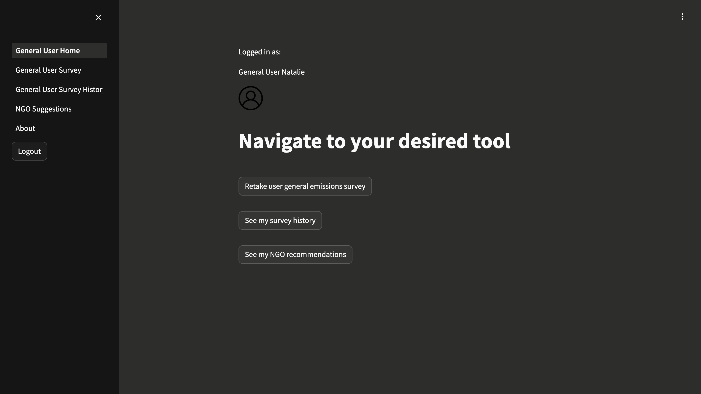
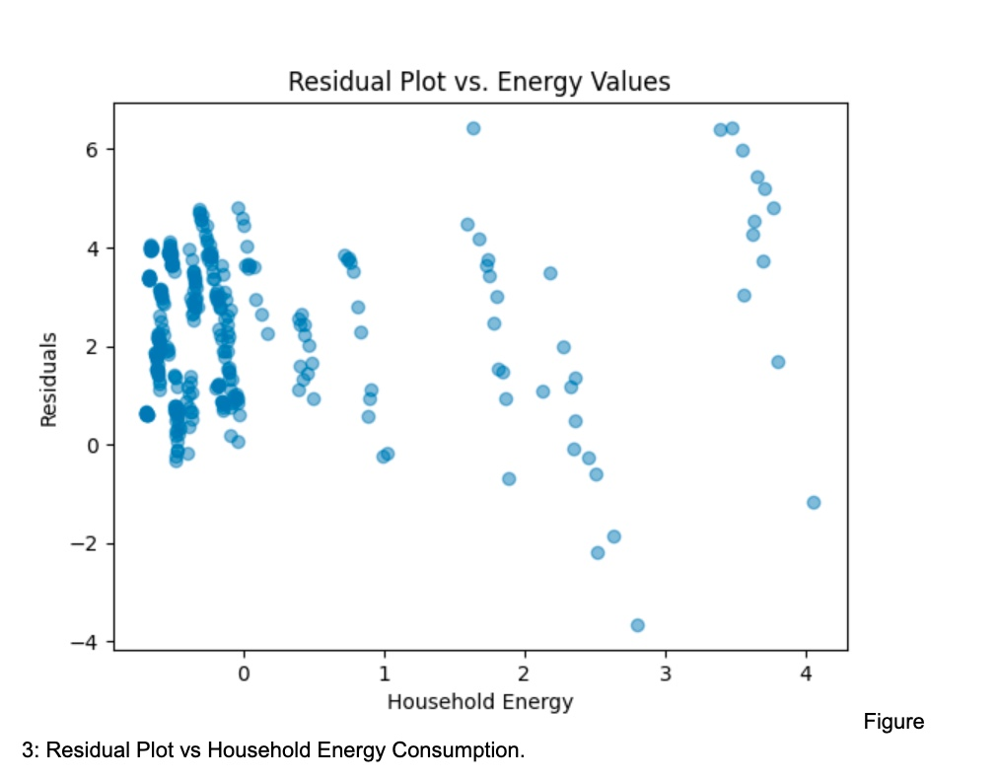

# API routes and purposes

### User Routes

u/UserCars (GET)
Gets all car survey data history for the user
u/UserAddCar (PUT)
Allows the user to add additional car survey data

u/UserResidential (GET)
Gets all residential survey data history for the user

u/UserFlights (GET)
Gets all flight survey data history for the user

u/UserTransport (GET)
Gets all transport survey data history for the user

u/UserAddRes (PUT)
Updates this user's residential data based on survey

### NGO Routes

n/NGOupdate (PUT)
Updates the NGO given filled out data in NGO table

n/tags (GET)
Gets the tag description for all tags for the NGO user

n/EnterpriseMatch (GET)
Gets the all matching enterprise names and descriptions based on tags

n/ngomine (GET)
Gets all my NGO data from the NGO table

n/UserMatch (GET)
Gets all of the matching users based on tags

n/TagDelete (DELETE)
Allows NGOs to delete tags that they were associated with

n/NGOadd (POST)
Allows NGOs to add tags that they want to be associated with

### Enterprise Routes

e/tags (GET)
Gets all of the enterprise’s tags from database

e/NGOMatch (GET)
Gets all of the matching NGO's based on tags

e/EntCompare (GET)
Gets my emissions, my country's, and the average of other companies in same country

e/EntSupplyChain (GET)
Gets all the supply chain history for this enterprise

e/EntCosts (GET)
Gets all the operating cost history for this enterprise

e/EntFlights (GET)
Gets all the flights history for this enterprise

# Application Prototype

| User Homescreen                        | Enterprise Homescreen                          | NGO homescreen Diagram               |
| -------------------------------------- | ---------------------------------------------- | ------------------------------------ |
|  |  |  |

These are images of each of the user personas. The homescreen for each user persona allows them to implement the features mentioned in their respective user persona stories. The main features for users and enterprises include taking surveys to gather further information, while the NGO persona does not take a survey. Instead, NGOs select the tags they want to be associated with and are matched with users based on these tags.

| NGO Survey  

In the NGO user persona, NGOs decide which tags they want to be associated with.  
NGO users can add or delete tags if they so desire and they can also update their recorded information.

| Enterprise NGO Match

Enterprises have a feature where they can match with NGOs with the same tags as displayed in this screenshot.
There is also a comparison to your average company emission within the same country to give enterprises more insight on their emissions.

| User Survey

In the general user persona, users take a survey, and based on this survey data, the app interacts with a machine learning model to estimate future carbon emissions and provide data on their current carbon emissions.

Users can also see their survey history and previous emission data.

# Machine Learning
The ML model developed is a standard linear regression model used to predict the greenhouse gas emissions of an individual (measured in ktonnes) based on two features: household energy consumption (in TJ) and Motor Gasoline Consumption (in KTOES).

Originally, household energy consumption was divided into 4 separate categories: heating, cooling, water heating, and cooking. The correlation matrix can be seen below:

As  observed, all of these features have a strong correlation with carbon, the variable name for what is trying to be predicted. Energy used for cooling (energy_cooling) has the weakest correlation, and, upon being graphed in Figure 2, fails the test of linearity.

Figure 2: A plot of energy used in household cooling against greenhouse gas emissions. Colors represent different countries.

The was then fitted with the remaining subset features (Energy for heating, water heating, and cooking), reaching an R2 of 0.86 in Leave One Out Cross Validation (LOO-CV). However, the group decided to instead only use the total household value instead of the sub-categories since, for an end user, the total would show up on a power bill rather than each of these categories. Additionally, this is when the Gasoline dataset was added (column name gas) to help incorporate transportation, which is a large share of greenhouse gas emissions. In addition, the countries have been one-hot encoded throughout this process.

When this model was fit, an R2 of -4476.7 immediately threw red flags. Upon further inspection of the residuals, which summed to -4.196 rather than the expected 0, it was found that the one-hot encoded countries were overfitting the model. With only 12 observations per country, the 28 features (26 for the 27 countries + 2 features) was too much. After fixing this change, the final model produced an R2 of 0.96. The graphs of the residuals can be seen below.

The residuals generally appear like random noise, and are likewise usually positive. In Figure 5, some autocorrelation can be seen, as some pattern exists. Potentially adding the countries could resolve this, if not for the overfitting issue. In addition, Figure 3 and 4 have some vertical striping, which certainly is not random, but the issue seems minor.

Finally, the scatterplots for the two features can be seen below.

The scatterplots demonstrate that the R2 does make sense and fits given the data, which is extremely linear. As such, all the linear regression conditions are met.

This machine learning model predicts the amount of CO2 emissions in tons based on heating and gas usage. This is a rough prediction prone to refinement. 