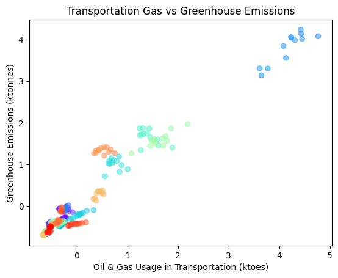
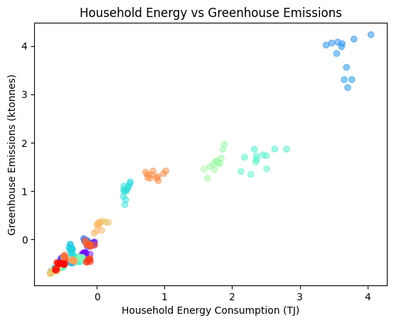
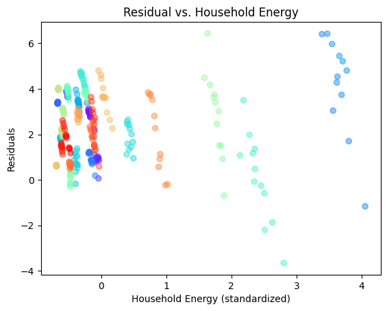
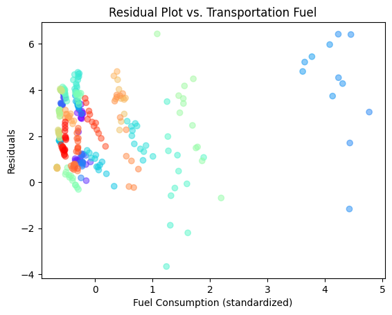
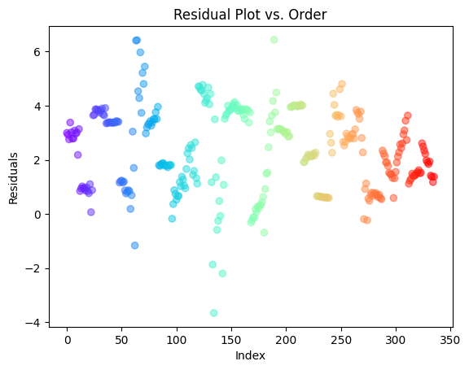

## Machine Learning

Our app comprises of two machine learning models. The first one, a linear regression model, predicts an individual's carbon footprint while the second model matches users to NGOs.

### Linear Regression

The linear regeression model precits a user's carbon footprint on the input features of that user's residential energy consumption and fuel for transportation.

#### Data Collection

The final dataset was obtained through the Eurostat SDMX 2.1 API utilizing the [pandaSDMX](https://pandasdmx.readthedocs.io/en/v1.0/index.html) library. This approach is highly scalable, allowing for the incorporation of additional data not only from Eurostat but also from other sources like the World Bank, due to the standardized SDMX format.

The data collected is regarded as high quality, given its origin from Eurostat, an organization known for upholding stringent data quality standards and maintaining a nonpartisan stance.

The final datasets collected include [Greenhouse Gas Emissions](https://ec.europa.eu/eurostat/databrowser/view/env_air_gge/default/table?lang=en&category=env.env_air.env_air_ai) as the metric for carbon emissions, [Household Energy Consumption](https://ec.europa.eu/eurostat/databrowser/view/nrg_d_hhq/default/table?lang=en&category=nrg.nrg_quant.nrg_quanta.nrg_d), and [Energy Consumption in Road Transport](https://ec.europa.eu/eurostat/databrowser/view/ten00127/default/table?lang=en&category=t_nrg.t_nrg_indic). As detailed in the previous posts, only the aggregated household energy quantites were used, rather than the individual household sectors due to some of the indivudal sectors having non-linear relationships.

#### Data Cleaning

The first data cleaning step performed was merging the data together. Afterwards, missing values were filled in using linear regression across the time series for each country. As no country was missing every data point, this would provide an approximation for those missing data, improving the model's accuracy. The features were then standardized in preperation for regression.

The scatterplots for the cleaned data can be seen below, with the color representing the country.

#### Correlation & Residuals

As documented in the previous posts, the correlation of the features was first tested to see if regression was the correct model. As seen below in the correlation matrix, there does appear to be a relationship in the data.

|                     | carbon_emissions | household_energy | transportation_fuel |
| ------------------- | ---------------: | ---------------: | ------------------: |
| carbon_emissions    |         1.000000 |         0.955914 |            0.996808 |
| household_energy    |         0.955914 |         1.000000 |            0.959322 |
| transportation_fuel |         0.996808 |         0.959322 |            1.000000 |

The model was then fitted to the data and residual plots generated, as seen below. The color represents the country.

The residuals appear generally random, but looking at the color reveals that there is a pattern related to country. In order to mitigate this, including the country would be beneficial, however, for this model overfitting occurred when the countries were one-hot encoded and included due to the small number of observations per country. Finding a way to preserve this information should improve the model, but the residuals appear good enough given current dataset. In addition, the residuals add up to zero and appear centered around zero on the graphs, indicating that overfitting did not occur. Overall, the conditions for linear regression are met, and the model has a leave-one-out cross-validated R2 score of 0.96.

#### Future Improvements

In the future, incorperating more data features such as meat consumption, air travel, and consumerism would all allow the model to more realistically model the world. For example, a person living in a tent in the woods who only takes public transportation, but eats a lot of red meat, would have a larger carbon footprint than our current model would predict. In addition, more data points to allow country to be a feature would also allow for improvements in the model.

### TF-IDF & Cosine Similarity

The second model

#### Data Collection

In order to train the model, real data from environmental organizations was needed to give to the generated NGOs. This would allow the generated NGOs to have the name and bio of a real organization, allowing a useful model to be created on it. The data was from Wikipedia, specifically the [List of Environmental Organizations](https://en.wikipedia.org/wiki/List_of_environmental_organizations), where each article was scraped, cleaned, vectorized, and then stored in the database.

#### Data Cleaning

The data cleaning on each article was quite minimal - the scraper returned just the body text for each page, which then had the references section and footers removed. Subsequently, any apostrophes and new line characters were removed to help encoding and prevent errors when inserted into the database. A lot more work could be done in this area to improve the term frequencies; the section headers are part of each document and thus are being weighted in the vector space. Removing them from the documents would improve the matching of documents that might contain those words in the body text.
After all the data was cleaned, an initial TF-IDF was performed across the corpus to generate vectors for each document which were stored in alongside the document in the database to prevent unessesary computation in recalculating the vectors when predicting. These sparse matrices encoded using a custom encoder before being stored to save space.

#### Testing

Being an unsupervised learning model, the Cosine Similarity of the term frequencies inverse document frequency does not have any metrics on whether it it is "good" or not. However, experimentation can provide an idea of the model's usefulness.

One experiment performed was querying the model with a specific prompt, in this case against nuclear weapons, to see if it would match with the article the concept was pulled from. Only a handful of the corpus was about nuclear weapons at all, and as such the difference (angle and distance) between the vector of the query and the articles should be small. Correctly, it identified the Ani-Nuclear Movement as the highest similarity:

> Prompt: Hi there! I'm [Your Name], a passionate advocate for global peace and the complete abolition of nuclear weapons. With a background in international relations and a deep commitment to humanitarian values, I have dedicated my career to raising awareness about the catastrophic consequences of nuclear warfare and advocating for a nuclear-free world

Similarity: `0.369`

> Article: The anti-nuclear movement is a social movement that opposes various nuclear technologies...

This experiment was performed with varying degrees of abiquity, but consistently the model correctly identified the article I was pulling from.

#### Future Improvements

Much of the future improvements to this model would be in the data cleaning phase, to ensure the term frequencies are not based on structural text and instead the actual content of the article. As mentioned above, this improvement would allow the Cosine Similarity to be more accurate to the content of the article, more accuratly matching users and NGOs. Decreasing the vector space would allow the cosine similarity matches to unique words to show more than matches to structural text that might not be break words, but are commonplace in the article format from which the data was collected. In addition, more NGO documents would be beneficial since it would provide more orgs that users could match to, improving user experiance.
